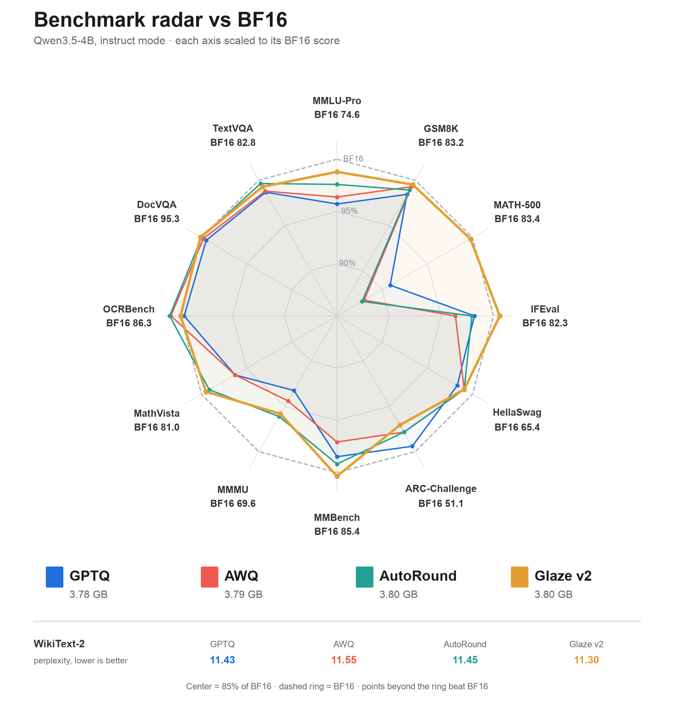

# 6. Glaze v2: quantizing from BF16 where the error matters

Glaze v2 quantizes `Qwen/Qwen3.5-4B` from BF16, at the size of AutoRound's W4A16 g128 export. It
draws on what [Glaze v1](05-glaze-v1.md) showed: calibrate on the domain you are scored on, measure
on data the method never trained on, and learn the rounding decisions instead of tuning around
them. It also spends the bytes that an 8-bit vision tower frees on the language model's most
sensitive layers.

**Status:** done. On the full suite Glaze v2 stays within 1 point of BF16 on every task except
ARC-Challenge (−1.5) and MMMU (−2.9). On
MATH-500 it scores 83.2 against BF16's 83.4 and AutoRound's 73.2, a paired gain of +10.0 points
over AutoRound (95% interval +6.6 to +14.0). Its checkpoint is 5 MB smaller than AutoRound's.

## Method

Glaze v2 has five stages, all run from the BF16 checkpoint.

**1. In-domain calibration data.** 4,419 prompts from public training sets, never a test set:

| Domain | Source | Prompts |
| --- | --- | ---: |
| Math | MATH (`EleutherAI/hendrycks_math`, train) | 1,600 |
| Multiple choice | ARC-Challenge (train) and SciQ (train) | 2,219 |
| Chat | UltraChat 200k (`train_sft`, first turns from row 20,000 on) | 600 |

- **Decontamination:** prompts sharing any 13-gram with a MATH-500 or MMLU-Pro test question are
  dropped (172 of the 7,500-problem math pool, 1 SciQ question).
- **Targets:** the BF16 model answers every prompt itself (vLLM, greedy, instruct mode, up to 2,048
  tokens). Answers cut off at that limit are dropped (337 of 4,419 for the 4B). The quantized model
  is trained toward BF16's own answers, never toward the datasets' gold answers.
- **Packing:** prompt and answer are joined under the chat template into 2,048-token blocks, with
  tokens shared 40% math, 40% multiple choice, 20% chat. 15% of prompts (fixed by a hash of the
  prompt) form a validation set. Calibration: 512 blocks (1.05M tokens). Validation: 64 blocks.
- **Tokens used:** the Fisher pass and the rounding loss use every token of a block, prompt and
  answer alike. The validation KL counts answer tokens only.
- **Overlap with the other methods' data:** 2 of the 600 chat prompts are among the 512 UltraChat
  conversations GPTQ, AWQ and AutoRound calibrate on (a random sample of the whole split).

The prompt set is frozen with a SHA-256 lock (`data/glaze2/prompts.lock.json`).

**2. Fisher pass.** One backward pass of the BF16 model per calibration block, with labels sampled
from its own next-token distribution, gives:
- the diagonal Fisher factors of every Linear's inputs and outputs, which predict how much loss a
  given weight error costs (used for the allocation);
- a weight for every token and hidden channel of every layer's output (clipped to 0.1–10× the
  mean), which turns each layer's reconstruction error into an estimate of the loss it causes (used
  for the rounding).

**3. Byte-neutral allocation.** Storing the vision tower's Linears at 8 bits (group size 128)
instead of BF16 frees about 320 MB. Glaze v2 spends those bytes on the language model, so the
checkpoint stays no larger than AutoRound's:
- **Options:** 4-bit with group size 128, 64 or 32, and 8-bit with group size 128, all served by
  vLLM's Marlin kernels.
- **Units:** layers vLLM fuses into one kernel take the same option (q/k/v, gate/up, and DeltaNet's
  input projections).
- **Choice:** a multiple-choice knapsack, solved exactly by dynamic programming over 64 KiB cost
  bins, maximizes the Fisher-predicted loss saving within the freed bytes, less a 2 MB margin. The
  prediction is an approximation: it multiplies per-channel input and output second moments,
  ignores interactions between layers, and is computed for round-to-nearest errors before the
  rounding is learned.

On the 4B it chose 8 bits for 40 of 152 units, group size 32 for 43, group size 64 for 38, and kept
31 at group size 128 (316 MB). The pilot's 16 blocks and the full 512 gave the same choice.

**4. Learned rounding and clipping.** Layer by layer, every quantized Linear learns a rounding
offset per weight (−0.5 to +0.5 of a grid step) and a clipping factor per group (0.5 to 1):
- **Objective:** the Fisher-weighted mean squared error between the quantized layer's output and
  the BF16 layer's output. The quantized layer is fed the quantized model's own inputs, so each
  layer corrects error from the layers before it.
- **Update:** signed gradient descent (learning rate 0.005, decaying linearly), 8 blocks per step,
  up to 400 steps per layer.
- **Selection:** the validation loss is measured every 25 steps; training stops after 4 evaluations
  without improvement, and the best state is kept. On the 4B every layer ran all 400 steps, so
  early stopping never triggered.
- **Precision:** scales are computed and stored in BF16 (straight-through estimates in training),
  so the trained model is exactly the model the export stores.

**5. Export.** compressed-tensors, with one config group per option and an exact module list, served
by stock vLLM 0.29. The token embeddings and `lm_head` stay in BF16, as in AutoRound's export (vLLM
cannot serve Qwen3.5's embeddings quantized). The multi-token-prediction weights, which neither
transformers nor this evaluation uses, are not exported.

| | |
| --- | --- |
| Code | `e2cb1cb` (0.8B proxy study), `d3a2e2b` (4B) |
| Hardware | One NVIDIA A30 (24 GB) for the proxy; one NVIDIA A100 (40 GB) for the 4B |
| 4B quantization | 44 min (Fisher pass and 32 layers), peak GPU memory 19.4 GiB |
| Checkpoint | 3,795,765,945 bytes (AutoRound: 3,800,831,215) |
| Variant | `glaze2_w4a16_g128` in `configs/variants/feature1.yaml` |

## Phase 1: Qwen3.5-0.8B proxy

The method was first tested on `Qwen/Qwen3.5-0.8B` (revision `2fc0636`), which has the 4B's hybrid
DeltaNet/attention layout and vision tower. There the vision tower frees 37% of the language
model's bytes, against 18% on the 4B, so the proxy's allocation was capped at the 4B's share.

Four exports, each scored by mean KL to BF16 on the validation blocks' answer tokens. These blocks
also select each layer's rounding state (stage 4), so the scores are validation, not test, results:

| Variant | In-domain KL | Chat KL | Checkpoint |
| --- | ---: | ---: | ---: |
| A: AutoRound W4A16 g128 (UltraChat calibration) | 0.0509 | 0.0541 | 988.3 MB |
| B: AutoRound on Glaze v2's calibration blocks | 0.0263 | 0.0560 | 988.3 MB |
| C: Glaze v2 rounding, every Linear at 4-bit g128 | 0.0247 | 0.0497 | 990.4 MB |
| D: Glaze v2 in full | **0.0140** | **0.0282** | 937.4 MB |

Each step changes more than one thing, so the steps are not clean ablations:
- **B against A** (−48% in-domain, +3% chat): the in-domain data, but also 512 calibration blocks
  instead of AutoRound's 128.
- **C against B** (−6% in-domain, chat recovered): Glaze's whole rounding pipeline in place of
  AutoRound's (Fisher weighting, 400 steps instead of 200, validation-based selection).
- **D against C** (−43% on both domains): the allocation together with the 8-bit vision tower that
  pays for it. D is also 5% smaller than A, so this is a no-larger comparison, not an equal-size one.
- **Together** (D against A): 72% less in-domain KL and 48% less on chat. This passed the gate
  fixed before the study (at least 15% in-domain, chat no more than 5% worse, no larger).

## Phase 2: Qwen3.5-4B

Only Glaze v2 in full was built, against AutoRound's published export (`autoround_w4a16_g128`).
The same gate was applied before any benchmark ran.

### Validation KL

| Model | In-domain KL | Chat KL |
| --- | ---: | ---: |
| AutoRound W4A16 g128 | 0.0305 | 0.0435 |
| Glaze v2 | **0.0123** | **0.0310** |

60% less in-domain KL and 29% less on chat, on the validation blocks that also selected each
layer's state. A 16-block, 10-step pilot of the same pipeline had 13% less in-domain KL and 22%
*more* on chat: the 4B needs the full calibration set and training. Every layer used all 400 steps
and was still improving. The benchmarks below are the untouched evaluation.

### Drift

Replayed along BF16's 1,501 MATH-500 and MMLU-Pro answers (2.3M tokens), as in the
[drift study](03-drift-study.md):

| Model | Flip rate | Loss | Excess loss |
| --- | ---: | ---: | ---: |
| BF16 (noise floor) | 0.35% | 0.128 | — |
| INT8 W8A8 | 2.42% | 0.139 | 0.011 |
| **Glaze v2** | **3.29%** | **0.142** | **0.014** |
| AutoRound W4A16 g128 | 4.96% | 0.170 | 0.042 |
| AWQ W4A16 g128 | 5.42% | 0.178 | 0.050 |
| GPTQ W4A16 g128 | 5.70% | 0.182 | 0.054 |

Glaze v2 removes 66% of AutoRound's excess loss, and comes within 0.003 of INT8 W8A8 at 69% of its
size. Its flip rate is lower than AutoRound's at every position, from 3.7% (AutoRound 5.3%) in the
first 256 tokens to 3.0% (4.7%) beyond 4,096.

### Benchmarks

The full suite with the [instruct-track protocol](../evaluation.md#instruct-track). Change from
BF16 in parentheses.

| Task | BF16 | GPTQ | AWQ | AutoRound | Glaze v2 |
| --- | ---: | ---: | ---: | ---: | ---: |
| MMLU-Pro | 74.6 | 71.4 | 71.9 | 72.8 | **73.7** (−0.9) |
| GSM8K | 83.2 | 81.9 | 82.6 | 82.3 | **82.8** (−0.4) |
| MATH-500 | 83.4 | 75.8 | 73.4 | 73.2 | **83.2** (−0.2) |
| IFEval | 82.3 | 80.8 | 79.3 | 80.6 | **82.8** (+0.5) |
| HellaSwag | 65.4 | 64.3 | 64.8 | 64.8 | 64.8 (−0.6) |
| ARC-Challenge | 51.1 | 50.8 | 50.0 | 50.0 | 49.6 (−1.5) |
| WikiText-2 (lower is better) | 10.95 | 11.43 | 11.55 | 11.45 | **11.30** |
| MMBench (dev, EN v1.1) | 85.4 | 84.1 | 82.9 | 84.7 | **85.7** (+0.3) |
| MMMU (val) | 69.6 | 64.9 | 65.7 | 66.9 | 66.7 (−2.9) |
| MathVista (mini) | 81.0 | 78.0 | 78.0 | 80.3 | **80.6** (−0.4) |
| OCRBench | 86.3 | 86.0 | 87.1 | 87.2 | 86.3 (0.0) |
| DocVQA (val) | 95.3 | 94.8 | 95.1 | 95.3 | **95.4** (+0.1) |
| TextVQA (val) | 82.8 | 81.7 | 81.8 | 82.5 | 82.2 (−0.6) |
| Checkpoint size | 9.32 GB | 3.78 GB | 3.79 GB | 3.80 GB | 3.80 GB |

The chart is drawn by `scripts/plot_benchmark_radar.py` from the scores above.

Reasoning panel, change from BF16 and from AutoRound on the same questions (paired bootstrap,
2,000 resamples):

| Comparison | MMLU-Pro (1,001) | MATH-500 | IFEval |
| --- | ---: | ---: | ---: |
| AutoRound − BF16 | −2.2 [−4.4, +0.0] | −10.2 [−14.0, −6.6] | −1.7 [−4.3, +0.9] |
| Glaze v2 − BF16 | −2.5 [−4.7, −0.4] | −0.2 [−3.4, +2.8] | +0.6 [−2.0, +3.3] |
| Glaze v2 − AutoRound | −0.3 [−2.4, +2.0] | **+10.0 [+6.6, +14.0]** | +2.2 [−0.6, +5.0] |

Answers that reach the 8,192-token limit:

| Model | MATH-500 | MMLU-Pro (1,001) |
| --- | ---: | ---: |
| BF16 | 3.6% | 5.7% |
| Glaze v2 | 5.2% | 6.5% |
| AutoRound | 7.0% | 8.9% |
| GPTQ | 8.0% | 8.0% |

## Findings

- **MATH-500 is recovered.** Every other 4-bit method loses 7.6–10.2 points there; Glaze v2 loses
  0.2, and fewer of its answers loop until the limit.
- **Elsewhere the two are close.** On the panel, MMLU-Pro (−0.3) and IFEval (+2.2) against
  AutoRound have intervals that include zero. OCRBench (−0.9), ARC-Challenge (−0.4) and MMMU (−0.2)
  have no paired intervals and are within the run-to-run spread; no non-inferiority margin was set
  in advance.
- **MMMU is the largest remaining gap** (−2.9 from BF16), shared with every 4-bit method. The
  calibration data has no images.
- **The full recipe works; its parts are not yet isolated.** Together they removed 72% of
  AutoRound's in-domain validation KL on the proxy and 60% on the 4B. Which part matters most needs
  controls this study did not run: the same data at equal volume, Fisher weighting switched off
  under a fixed allocation, other allocation policies at the same byte budget, and AutoRound's own
  mixed-precision mode as a baseline.

## Caveats

- **The calibration domains match the benchmark domains,** by design: math and multiple-choice
  science questions. Prompts sharing a 13-gram with MATH-500 or MMLU-Pro are removed. ARC-Challenge
  training questions are used and are not checked against its test split; its score is below BF16
  and AutoRound's. Training targets are BF16's own answers, so the method moves the model toward
  BF16, not toward the correct answers.
- **Different GPUs.** Glaze v2's suite ran on an A100; BF16 and the other variants on A30s (both
  GA100). Repeated runs of one model differ by about 1–2 points: AutoRound scored 74.6 on MATH-500
  in an earlier A100 run and 73.2 here.
- **MMMU answer extraction** failed on 6 of 900 validation answers (BF16 4, GPTQ 7, AutoRound 8), as
  [described](../evaluation.md) for every model.

## Artifacts

- Model: [Qwen3.5-4B-Kiln-Glaze-W4A16](https://huggingface.co/lazybrick/Qwen3.5-4B-Kiln-Glaze-W4A16)
- Records: [`lazybrick/kiln-evals`](https://huggingface.co/datasets/lazybrick/kiln-evals)
